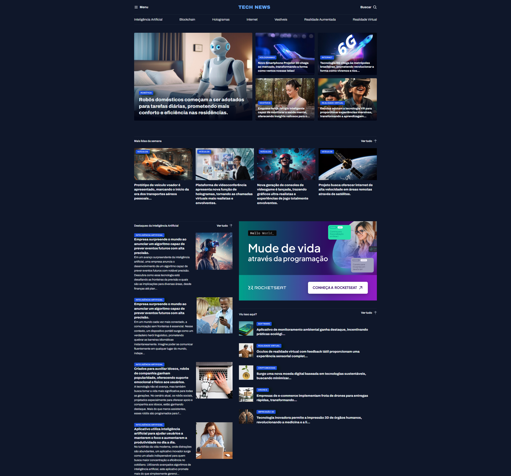

# Portal de Notícias sobre Tecnologia

Portal de Notícias é uma página web construída com **HTML** e **CSS**, que utiliza técnicas de **GRID** para a criação de um layout moderno. A página demonstra um portal de notícias voltado para área de tecnologia.

[](https://portalnoticias.hallanchristian.com.br)

## Visão Geral

A página inicial do Portal de Notícias apresenta seções de noticías da área de tecnologia, com menu, destaque, blog e banner ads.

### Tecnologias Utilizadas

- **HTML5**: Estrutura semântica da página.
- **CSS3**: Estilização e design visual da página.
  - **GRID**: Usado para alinhar e distribuir os elementos.
  - **Atributos de CSS**: Utilizados para ajustar o espaçamento, estilo de fonte, e outros detalhes visuais.

## Funcionalidades

1. **Menu de Listagem das Categorias**:
2. **Seção Destaque**:
3. **Seção Mais Lidas Da Semana**
4. **Seção ADS**
5. **Seção BLOG**

## Como Executar o Projeto

1. Clone o repositório:
   ```bash
   git clone https://github.com/hallancma/mba-rockeseat-sirius-projetos-03-portal-de-noticias.git
   ```
2. Abra o arquivo `index.html` em seu navegador para visualizar a página.

## Estilos e Design

O projeto utiliza uma combinação de **GRID** para organização de elementos, garantindo que o layout seja flexível. A fonte utilizada no projeto é moderna e legível, proporcionando uma experiência agradável ao usuário.

## Ver Projeto

Para ver o projeto em funcionamento, você pode visitar o link abaixo:

[Ver Projeto](https://portalnoticias.hallanchristian.com.br/)
